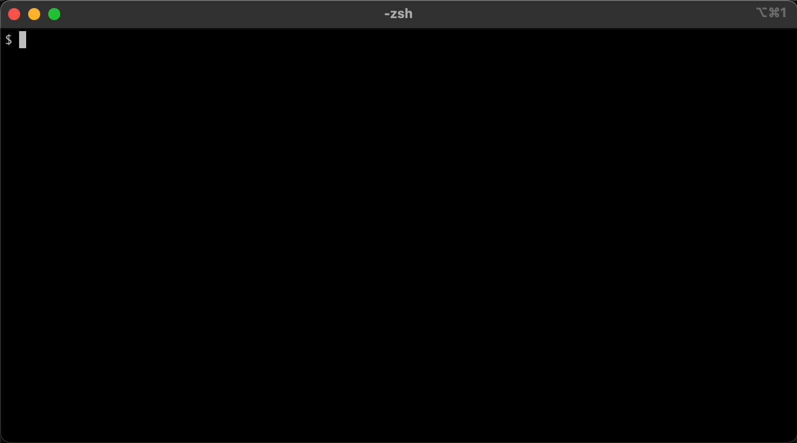

# git-sparse-worktree

a prototype that makes it convenient to create sparse worktrees. leverages `git ls-tree` for tab completion so you can interactively select subfolders to clone without checking out the entire repo. 



## usage

```console
$ eval "$(git-sparse-worktree completion)"
$ git clone --no-checkout https://github.com/torvalds/linux
$ cd linux
$ git-sparse-worktree add -b docs Documentation/
$ cd docs
```

## todo

* make file completions work properly
* bash + fish completion support
* support **/foo?
* support fuzzy-matching?
* support repo-defined nodes? e.g. a list of directories or "**/devenv.nix"
* support ephemeral worktrees? e.g. add --rm
